# ☕ Coffee Manager

**SaaS multi-tenant para compraventas de café pergamino en Colombia.** Reemplaza el cuaderno y el Excel del punto de compra: recepción con calidad (humedad, factor de rendimiento, defectos), bodega (secado y trilla), ventas y contratos, pagos, anticipos, préstamos y reportes, todo aislado por negocio.

> **Estado:** MVP funcional de punta a punta (compra → bodega → venta → pago → reporte). Se está ejecutando el **plan técnico v1.0** para dejarlo listo para pilotos y para cobrar. Sprint 0 (bases) casi cerrado; ver [Hoja de ruta](#hoja-de-ruta).

---

## Contenido

- [Qué hace hoy](#qué-hace-hoy)
- [Capturas](#capturas)
- [Hoja de ruta](#hoja-de-ruta)
- [Arquitectura](#arquitectura)
- [Desarrollo local](#desarrollo-local)
- [Pruebas y calidad](#pruebas-y-calidad)
- [Despliegue](#despliegue)
- [Documentación](#documentación)
- [Cómo contribuir](#cómo-contribuir)

---

## Qué hace hoy

| Módulo | Qué resuelve |
| --- | --- |
| **Proveedores** | Registro de caficultores con identificación, contacto y estado de cuenta. |
| **Recepción** | Compra de café **mojado, pergamino seco o pasilla**. Peso bruto/tara/neto, humedad, factor de rendimiento (calculado o manual), defectos y precio tomado de la **tabla de precios del día** por tramos de factor y humedad. El precio queda copiado e inmutable en la recepción. |
| **Bodega** | Inventario como **libro de movimientos** (nunca un saldo que se sobrescribe), procesos de **secado** y **trilla**, y destino de la pasilla (mezcla o venta separada). |
| **Ventas y contratos** | Ventas con lotes de origen, compradores, contratos de venta con entregas parciales. |
| **Cortes** | Despachos por viaje, agrupados por período. |
| **Pagos** | Pagos con varios métodos, **anticipos** a proveedores, conciliación de anticipos y **estado de cuenta** por proveedor. |
| **Préstamos** | Préstamos a proveedores con abonos y saldo vigente. |
| **Facturación** | Modelo de facturas con adaptador de proveedor tecnológico (pendiente de conectar un proveedor real). |
| **Reportes** | Compras, ventas por comprador, inventario, saldos de proveedores, exportación a **Excel y CSV**. |
| **Configuración** | Puntos de compra, usuarios y **roles con permisos** por negocio. |
| **Plataforma** | Panel del super-administrador: aprobar solicitudes, crear negocios (tenants) y asignar **planes** con límites y módulos. |
| **Transversal** | Multi-tenant con aislamiento por `tenantId` (falla cerrado), auditoría automática de modelos con plata, montos en `Decimal`. |

## Capturas

Datos de demostración ficticios, tomados de un negocio de prueba.

| | |
| --- | --- |
| **Inicio de sesión** | **Recepción de café** |
| 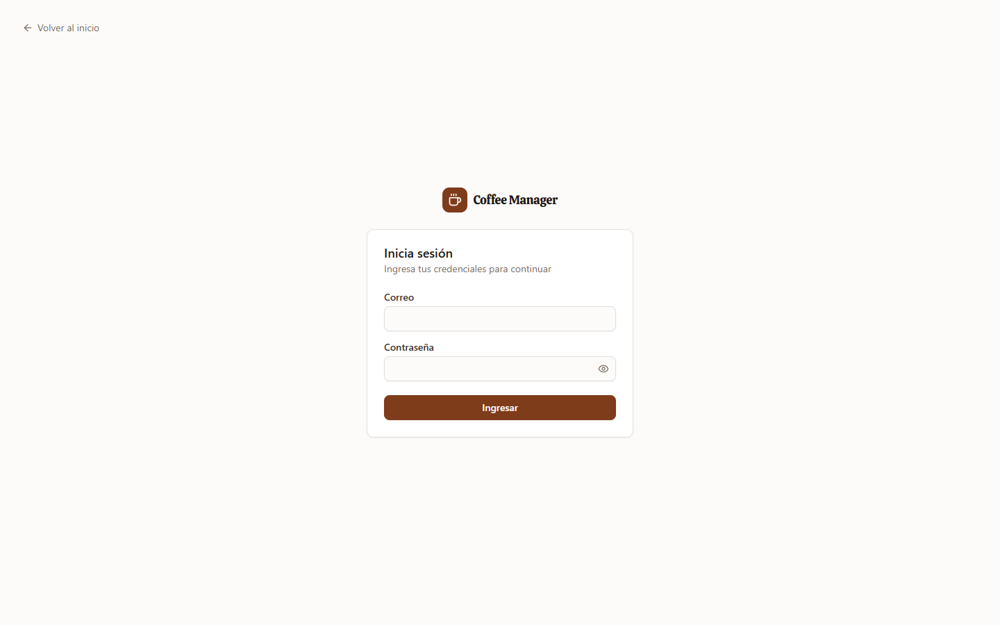 | 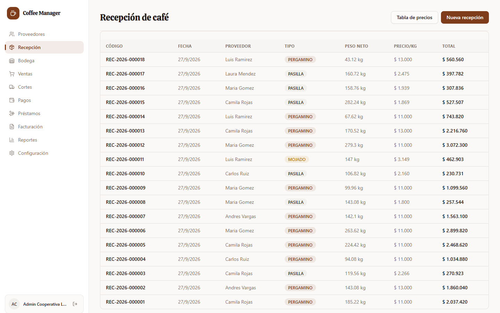 |
| **Nueva recepción · pergamino** (humedad, factor, defectos) | **Nueva recepción · mojado** (precio directo) |
| 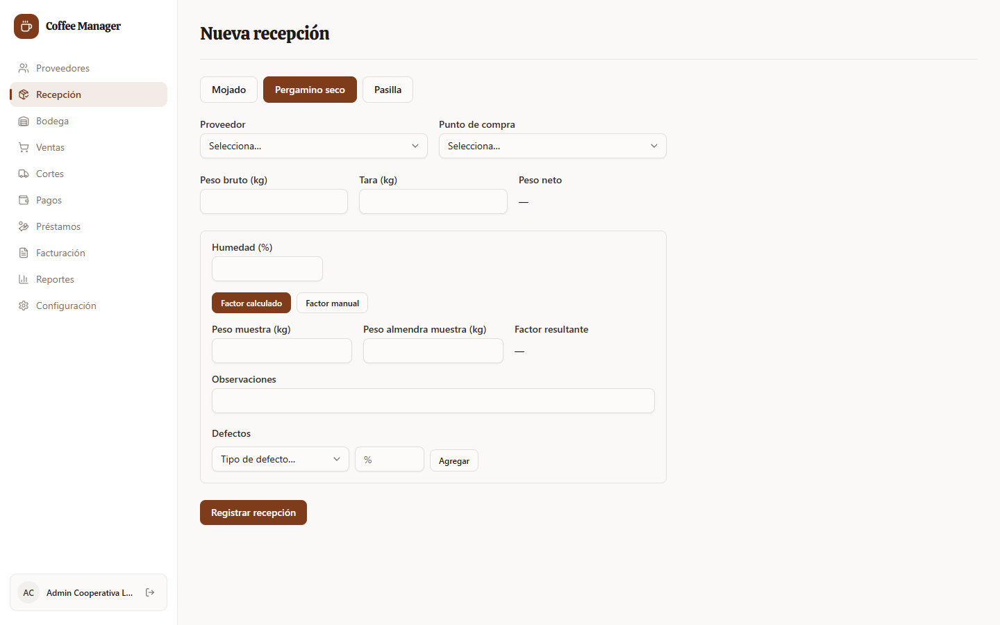 | 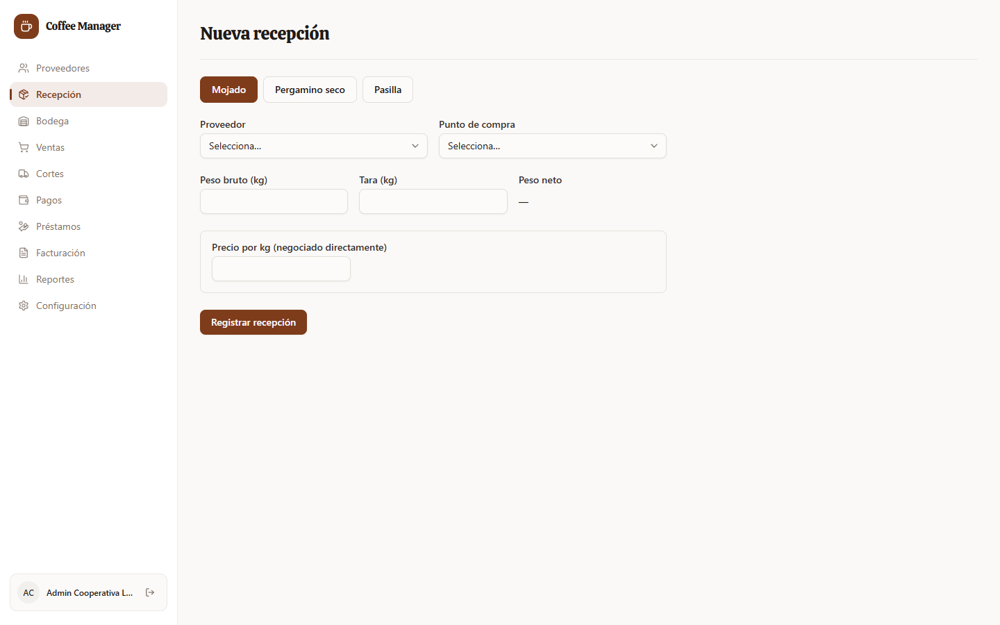 |
| **Tabla de precios del día** | **Proveedores** |
| 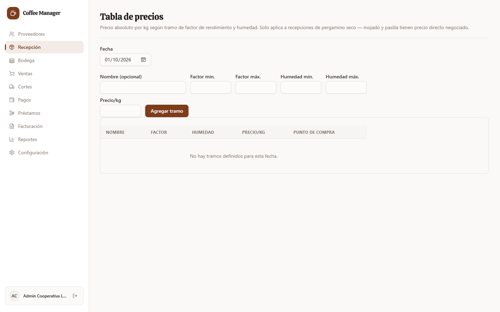 | 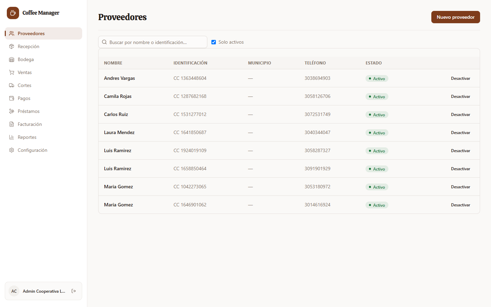 |
| **Bodega e inventario** | **Ventas** |
| 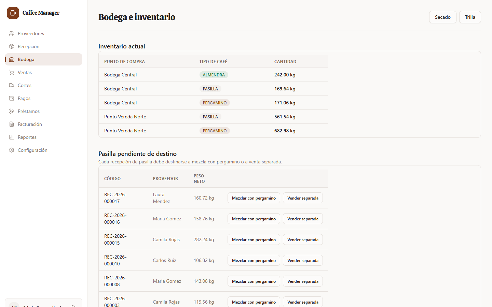 | 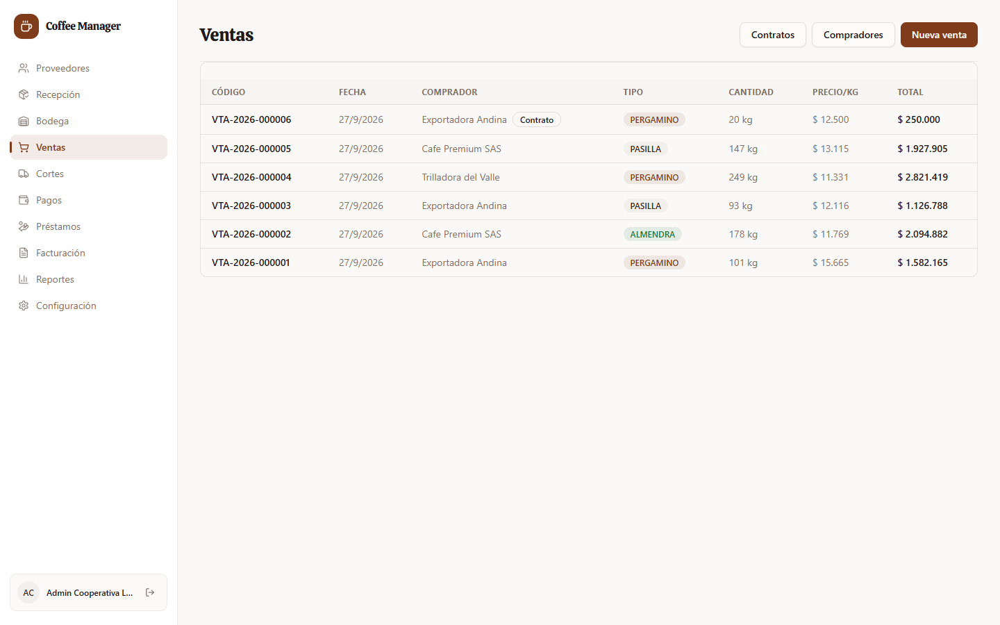 |
| **Pagos** | **Préstamos** |
| 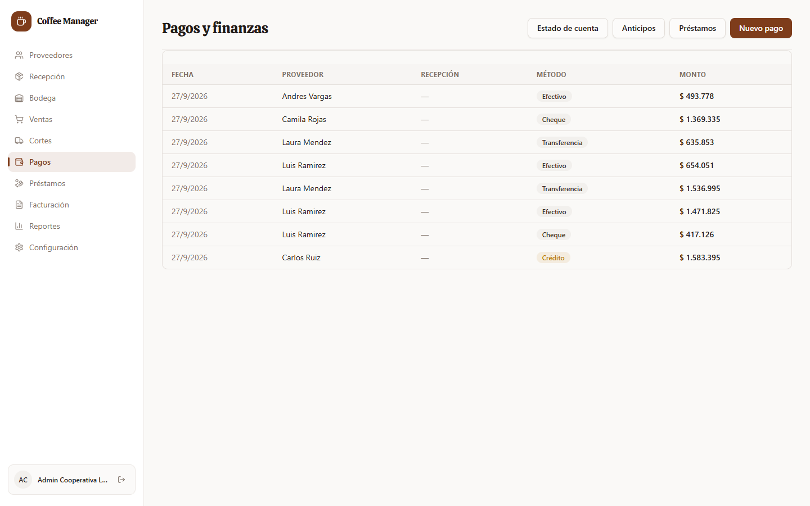 | 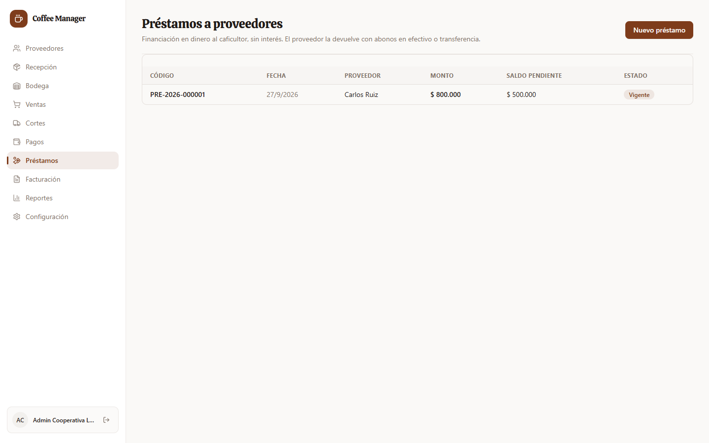 |
| **Reportes** | **Configuración** |
| 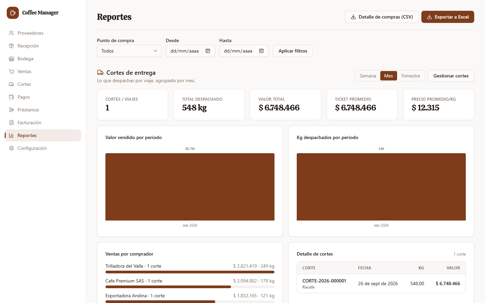 | 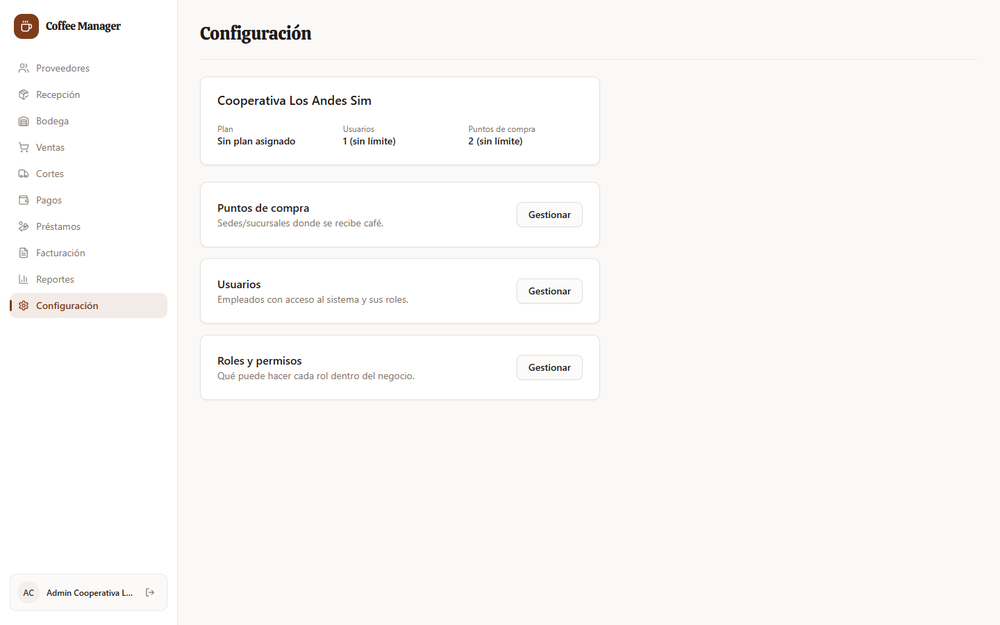 |

## Hoja de ruta

El plan completo (requisitos RF/RNF, casos de uso, modelo de datos, sprints y hallazgos) está en [`docs/TECNICO.md`](docs/TECNICO.md); el avance real, en [`docs/PROGRESO.md`](docs/PROGRESO.md).

**Meta del producto:** que el caficultor llegue, descargue y se vaya con su recibo en **45 segundos o menos**, y que el sistema pueda salir a pilotos y crecer sin reescribirse.

| Sprint | Fechas | Entregables | Estado |
| --- | --- | --- | --- |
| **0 · Bases** | 1–14 oct 2026 | Consecutivos atómicos por tenant (H1), pruebas unitarias del dominio (H2), CI con cobertura mínima y verificación de migraciones, Sentry | 🟡 En curso: consecutivos, pruebas y CI hechos; falta Sentry |
| **1 · Recepción rápida** | 15–28 oct | Pantalla de recepción rápida con valores por defecto, búsqueda de proveedor por cédula/nombre/apodo (`pg_trgm`), alta exprés, navegación con Enter, **llave de idempotencia** | ⚪ Pendiente |
| **2 · Recibo, anulación y retención** | 29 oct–11 nov | Recibo para impresora térmica 58/80 mm y compartir por WhatsApp, **anulación** con movimiento compensatorio, **retención en la fuente** parametrizable, pago en el mismo paso | ⚪ Pendiente |
| **3 · Infraestructura** | 12–25 nov | Hostinger KVM 2 + Coolify, backups diarios con restauración probada, Redis + BullMQ, límites de peticiones y cabeceras de seguridad, autorización de datos (Ley 1581) | ⚪ Pendiente |
| **4 · Pilotos y onboarding** | 26 nov–9 dic | Importación de proveedores y saldos desde Excel, asistente de configuración inicial, 3 pilotos registrando sus compras | ⚪ Pendiente |

**Después de pilotos** (solo si pasa el punto de decisión del 5 de enero de 2027):

- **Fase 2 (ene–mar 2027):** documento soporte electrónico con proveedor tecnológico, modo sin conexión (PWA con cola local), cobro de suscripción y suspensión por mora.
- **Fase 3 (abr–jun 2027):** fincas por proveedor y trazabilidad para el reglamento europeo **EUDR**, lectura directa de la báscula, estado de cuenta del caficultor por WhatsApp.
- **Fuera de alcance por ahora:** app nativa (la PWA cubre el caso), integración contable (Siigo / World Office), multi-moneda y multi-país.

### Hallazgos técnicos que ordenan el plan

| # | Hallazgo | Estado |
| --- | --- | --- |
| H1 | Códigos de recepción con `count()+1` (duplicados bajo concurrencia) | ✅ Cerrado (sprint 0) |
| H2 | Sin pruebas de los cálculos de plata | ✅ Cerrado (sprint 0) |
| H3 | Formulario de recepción lento (9+ campos sin valores por defecto) | Sprint 1 |
| H4 | No se puede anular una recepción | Sprint 2 |
| H5 | Sin retención en la fuente | Sprint 2 |
| H6 | Sin cola de trabajos (PDF, WhatsApp, DIAN en la petición) | Sprint 3 |
| H7 | Sin idempotencia en `POST /recepciones` | Sprint 1 (backend hecho; falta la web) |
| H8 | "Factura" por recepción; debe ser documento soporte | Fase 2 |

## Arquitectura

**Monolito modular** (una API NestJS con módulos por dominio) en un solo servidor, cada pieza en su contenedor. Lo lento o externo (PDF, WhatsApp, DIAN) irá a un worker con cola. Las decisiones están registradas como ADR en [`docs/adr/`](docs/adr).

```
apps/
  web/      Frontend Next.js 14 (App Router, TypeScript, Tailwind, shadcn/ui)
  api/      Backend NestJS 11 (TypeScript, Prisma 5, PostgreSQL)
packages/
  shared-types/         Tipos TypeScript compartidos entre web y api
  validation-schemas/   Esquemas Zod compartidos
  eslint-config/        Configuración de lint compartida
docker/     docker-compose y Dockerfiles para desarrollo y producción
docs/       Plan técnico, bitácora, ADR, diagramas y guías de despliegue
```

Monorepo con **pnpm workspaces** + **Turborepo**.

**Reglas de dominio que no se rompen** (detalle en [`CLAUDE.md`](CLAUDE.md)): montos siempre `Decimal`; una recepción nunca se edita ni se borra (corregir = anular + registrar otra); `precioKg`, retención y neto se copian e inmutan al guardar; inventario como ledger; consecutivos atómicos; lo lento va a cola; todo listado filtra por índice que empieza en `tenantId` y pagina por cursor.

| Diagrama | Archivo |
| --- | --- |
| Modelo entidad-relación completo | [`docs/diagramas/mer.md`](docs/diagramas/mer.md) |
| Secuencia de la recepción rápida | [`docs/diagramas/secuencia-recepcion.md`](docs/diagramas/secuencia-recepcion.md) |

## Desarrollo local

**Requisitos:** Node.js 20+ (recomendado 22), pnpm (`corepack enable`) y Docker con Docker Compose.

1. Instalar dependencias:

   ```bash
   pnpm install
   ```

2. Copiar variables de entorno (nunca se versionan los `.env`):

   ```bash
   cp apps/api/.env.example apps/api/.env
   cp apps/web/.env.local.example apps/web/.env.local
   ```

3. Levantar PostgreSQL y Redis:

   ```bash
   docker compose -f docker/docker-compose.yml up -d postgres redis
   ```

4. Generar el cliente de Prisma, aplicar migraciones y sembrar el catálogo:

   ```bash
   pnpm db:generate
   pnpm db:migrate
   pnpm db:seed
   ```

5. Levantar web y API en modo desarrollo:

   ```bash
   pnpm dev
   ```

   - Web: http://localhost:3000
   - API: http://localhost:3001

### Scripts de la raíz

| Script | Descripción |
| --- | --- |
| `pnpm dev` | Levanta web + API en modo watch (turbo) |
| `pnpm build` | Build de producción de todo |
| `pnpm lint` | Lint (la API corre con `--fix`) |
| `pnpm test` | Pruebas unitarias |
| `pnpm db:generate` / `db:migrate` / `db:seed` | Prisma: cliente, migraciones y seed |

## Pruebas y calidad

| Qué | Comando | Notas |
| --- | --- | --- |
| Unitarias | `pnpm --filter api test` | Prisma simulado; rápidas |
| Cobertura con umbral | `pnpm --filter api test:cov` | ≥ 90 % de líneas en los servicios de `recepcion` y `pagos` |
| Integración (PostgreSQL real) | `pnpm --filter api test:int` | Requiere `DATABASE_URL` con migraciones aplicadas; incluye 100 llamadas concurrentes de consecutivos |
| Extremo a extremo | `pnpm --filter api test:e2e` | Prueba de ejemplo |

**CI** (GitHub Actions, en cada PR a `main`): instalación, lint, build, pruebas, cobertura mínima, migraciones, verificación de que `schema.prisma` coincide con las migraciones y pruebas de integración contra un PostgreSQL de servicio.

## Despliegue

- [`docs/DESPLIEGUE-VERCEL.md`](docs/DESPLIEGUE-VERCEL.md) — guía por paneles, gratis: web en Vercel, API en Render y base de datos en Neon.
- [`docs/DESPLIEGUE-ORACLE.md`](docs/DESPLIEGUE-ORACLE.md) — todo el stack en una VM Oracle Cloud *Always Free* (piloto 24/7).
- **Objetivo del plan técnico:** un VPS Hostinger KVM 2 con Coolify, backups diarios fuera del servidor y monitoreo (sprint 3, ver [ADR-006](docs/adr/006-hostinger-coolify.md)).

## Documentación

| Documento | Para qué sirve |
| --- | --- |
| [`docs/TECNICO.md`](docs/TECNICO.md) | Plan técnico v1.0: requisitos, casos de uso, modelo de datos, arquitectura, escalabilidad, sprints y hallazgos |
| [`docs/PROGRESO.md`](docs/PROGRESO.md) | Bitácora de avance. **Lo primero que hay que leer al retomar** |
| [`docs/doc.md`](docs/doc.md) | Documento de proyecto (visión y alcance del MVP) |
| [`docs/requerimientos.md`](docs/requerimientos.md) | Decisiones de diseño y requerimientos del MVP |
| [`docs/adr/`](docs/adr) | Decisiones de arquitectura (ADR-001 a ADR-006) |
| [`CLAUDE.md`](CLAUDE.md) | Instrucciones permanentes para Claude Code en este repo |

## Cómo contribuir

- Una tarea = una rama `feat/…`, `fix/…`, `test/…`, `ci/…` o `docs/…` = un PR pequeño. **Nada se commitea directo en `main`.**
- Commits convencionales (`feat:`, `fix:`, `test:`, `refactor:`, `docs:`).
- Pruebas primero en la lógica de cálculo; cada regla de negocio nueva lleva prueba de integración con PostgreSQL real.
- Migraciones con el patrón *expandir y contraer*: nunca renombrar o borrar una columna en un solo paso.
- Antes de cerrar una tarea: lint, pruebas y build en verde, y actualizar `docs/PROGRESO.md` y `docs/TECNICO.md`.
