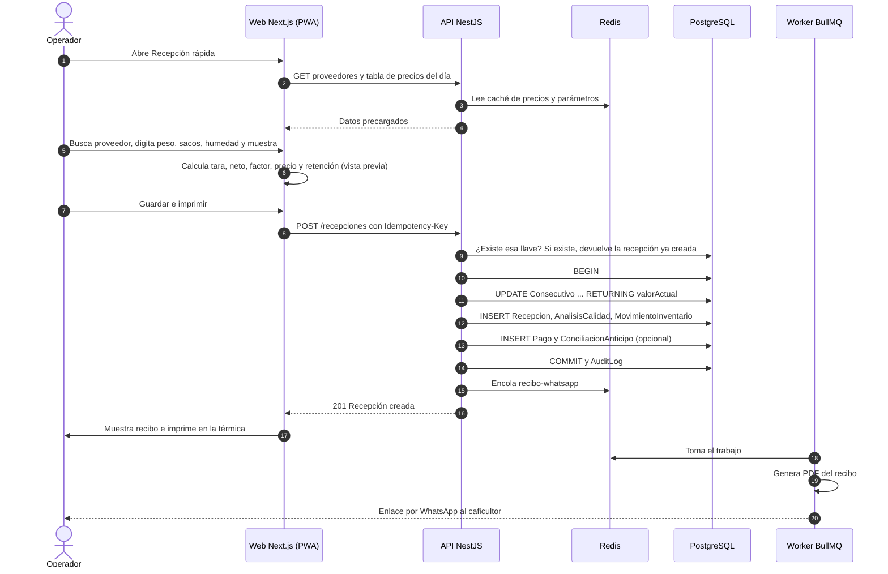

# Coffee Manager — Documentación técnica y plan de desarrollo

Sep 30, 2026 · @Milton · versión 1.0

## Propósito y alcance

**Este documento define qué falta construir en Coffee Manager, en qué orden y con qué reglas, para que el sistema salga a pilotos y luego crezca sin reescribirse.** Es el complemento técnico del plan de negocio y debe vivir también en el repositorio (`docs/`), actualizándose con cada sprint.

Alcance: el MVP actual del repositorio `josearpa123/Caf-_manager` (commit `fc1262e`) y el trabajo pendiente hasta tener el producto listo para cobrar, más la ruta de crecimiento posterior.

| Artefacto | Estándar de referencia | Sección |
| --- | --- | --- |
| Requisitos funcionales y no funcionales | ISO/IEC/IEEE 29148 (especificación de requisitos), ISO/IEC 25010 (atributos de calidad) | Requisitos |
| Diagrama y especificación de casos de uso | UML 2.5 | Casos de uso |
| Modelo entidad-relación y diccionario de datos | Notación pata de gallo (crow's foot) | Modelo de datos |
| Arquitectura y despliegue | Modelo C4 (contexto y contenedores) + diagrama de despliegue UML | Arquitectura |
| Decisiones de arquitectura | ADR (Architecture Decision Records) | Buenas prácticas |
| Seguridad | OWASP ASVS nivel 1, Ley 1581 de 2012 (datos personales) | Buenas prácticas |

Los diagramas de este documento son la versión para leer. El anexo trae los mismos diagramas en Mermaid para guardarlos en el repo, donde GitHub los dibuja solos.

## Estado actual y hallazgos técnicos

**La base está bien diseñada; los riesgos están en cuatro puntos concretos que se arreglan antes de los pilotos.** Revisé el schema de Prisma (34 modelos, 64 índices), los 15 módulos de la API y el formulario de recepción.

**Lo que ya está bien y hay que conservar:**

- Multi-tenant con una extensión de Prisma que inyecta el `tenantId` desde una lista blanca de modelos: si alguien agrega un modelo nuevo, queda sin acceso hasta registrarlo. Falla cerrado, que es lo correcto.
- Auditoría automática de los modelos con plata (recepción, pagos, anticipos, préstamos, ventas, facturas).
- Montos en `Decimal`, no en `float`, y precio por kg copiado e inmutable en cada recepción.
- Inventario como libro de movimientos (ledger), no como un saldo que se sobrescribe.
- Índices compuestos que empiezan por `tenantId` en las tablas de consulta frecuente.
- Operaciones de varios pasos dentro de `$transaction`.

**Hallazgos que pueden volverse cuello de botella o error en producción:**

| # | Hallazgo | Dónde | Riesgo | Corrección |
| --- | --- | --- | --- | --- |
| H1 ✅ | El código de recepción (`REC-2026-000123`) se genera con `count()` + 1 | `recepcion.service.ts` | Dos recepciones simultáneas en el mismo tenant obtienen el mismo código y una falla con error 500. Además `count()` se vuelve más lento a medida que crece la tabla | Tabla de consecutivos por tenant y tipo con `UPDATE … RETURNING` atómico (sprint 0) |
| H2 ✅ | Solo existe la prueba e2e de ejemplo; no hay pruebas de los cálculos | `apps/api/test` | Un cambio en el factor o el precio puede romper la plata de los clientes sin que nadie lo note | Pruebas unitarias del dominio con meta de cobertura (sprint 0) |
| H3 ✅ | El formulario de recepción pide 9+ campos sin valores por defecto | `recepcion/nueva/page.tsx` | No se cumple la meta de 45 segundos; el usuario vuelve al cuaderno | Recepción rápida (sprint 1; pantalla hecha, falta la medición de 45 s) |
| H4 ✅ | No hay anulación de recepciones ni campo de estado | modelo `Recepcion` | Los errores de digitación se quedan para siempre o se borran sin rastro | Estado + anulación con movimiento compensatorio (sprint 2; hecho en el backend y en el detalle de la web, ADR-010) |
| H5 ✅ | No hay cálculo de retención en la fuente | dominio de recepción y pagos | Incumplimiento tributario del cliente; argumento de venta perdido | Parámetros tributarios con vigencia (sprint 2) |
| H6 | No hay cola de trabajos; Redis está en el compose pero la API no lo usa | infraestructura | Generar PDFs, enviar WhatsApp o llamar a la DIAN dentro de la petición la vuelve lenta y frágil | BullMQ sobre Redis (sprint 3) |
| H7 ✅ | No hay protección contra reintentos (idempotencia) | `POST /recepciones` | Con mala señal, el usuario oprime dos veces y se crean dos recepciones | Llave de idempotencia por petición (sprint 1; backend de recepción hecho, ver ADR-007; backend de pagos, anticipos y ventas hecho; la web ya la envía en recepción, anulación, pagos, anticipos y ventas; falta en conciliaciones, cuyo endpoint aún no la acepta) |
| H8 | El módulo de facturación modela "factura" por recepción | modelo `Factura` | La compra a un caficultor no obligado se soporta con documento soporte, no con factura | Generalizar a `DocumentoElectronico` con tipo (fase 2) |

## Plan de desarrollo

**Cinco sprints de dos semanas (octubre a diciembre de 2026) dejan el producto listo para pilotos y para cobrar; lo demás se construye solo cuando los pilotos lo pidan.** Capacidad supuesta: 7 horas por semana mientras terminas el semestre, unas 14 horas por sprint. Si un sprint no cierra, se corre todo el calendario; no se recortan las pruebas.

| Sprint | Fechas | Entregables | Cierra hallazgos | Hecho cuando |
| --- | --- | --- | --- | --- |
| 0 · Bases | 1–14 oct | Consecutivos atómicos por tenant; pruebas unitarias de factor, tramo de precio, peso neto y valor total; CI que bloquea el merge si fallan; primeros ADR; Sentry (plan gratis) | H1, H2 | 100 recepciones concurrentes de prueba sin códigos repetidos; cobertura ≥ 90% en `calidad` y `recepcion` |
| 1 · Recepción rápida | 15–28 oct | Pantalla de recepción rápida; búsqueda de proveedor por cédula, nombre o apodo; alta exprés; valores por defecto; navegación con Enter; teclado numérico; llave de idempotencia | H3, H7 | Recepción completa en ≤ 45 s medida con cronómetro, 10 veces seguidas, en celular |
| 2 · Recibo, anulación y retención | 29 oct–11 nov | Recibo para impresora térmica de 58/80 mm y vista para compartir por WhatsApp; anulación con motivo y movimiento compensatorio; retención en la fuente parametrizable; pago en el mismo paso | H4, H5 | Un contador revisa 5 recibos con retención y los aprueba |
| 3 · Infraestructura | 12–25 nov | Hostinger KVM 2 + Coolify; backups diarios de PostgreSQL fuera del servidor y restauración probada; Redis + BullMQ para PDFs y mensajes; límites de peticiones, cabeceras de seguridad, monitoreo de disponibilidad; autorización de datos en el registro del proveedor | H6 | Restauración completa en < 1 h desde el backup de ayer |
| 4 · Pilotos y onboarding | 26 nov–9 dic | Importación de proveedores y saldos iniciales desde Excel; asistente de configuración inicial; corrección de lo que reporten los pilotos | — | 3 pilotos registrando todas sus compras del día en el sistema |

**Estado de avance (actualizar con cada PR):**

| Sprint | Estado | Detalle |
| --- | --- | --- |
| 0 · Bases | En curso | PR 1 hecho (pruebas de dominio de recepción, H2 parcial). PR 2 hecho: consecutivos atómicos en los 7 servicios (**H1 cerrado**). PR 3 hecho: pruebas de `pagos` (**H2 cerrado** en lo funcional; cobertura 100% de líneas en `recepcion` y `pagos`). PR 4 hecho: CI con umbral de cobertura (90% líneas en servicios de `recepcion` y `pagos`), verificación schema↔migraciones y pruebas de integración. Pendiente: Sentry (requiere aprobar dependencias) y activar la protección de la rama `main` en GitHub |
| 1 · Recepción rápida | En curso | PR 1 y 2 hechos: idempotencia en `POST /recepcion`, `/pagos`, `/anticipos` y `/ventas` con tabla genérica `IdempotencyKey` (ADR-007, **H7 cerrado en el backend**). PR 3 hecho: búsqueda de proveedor `GET /proveedores/buscar` con `pg_trgm`, `unaccent` y `apodo` (RF-02, ADR-008). PR 4 hecho: backend de recepción rápida (tara por sacos, `GET /tabla-precios/precio`). PR 5 hecho: pantalla `/recepcion/rapida` (**H3 cerrado en código**; falta medir los 45 s con cronómetro en celular), menú responsive y peso del saco en Configuración. Pendiente: medir con cronómetro 10 recepciones seguidas en celular (criterio de cierre del sprint); `ParametroTributario`/retención y recibo son del Sprint 2 |
| 2 · Recibo, anulación y retención | En curso | PR 1 hecho: zona horaria fija America/Bogota y retención en la fuente opcional por negocio con `ParametroTributario` sembrada y verificada (**H5 cerrado**, ADR-009). PR 2 hecho: anulación de recepciones (RF-07/08, CU-02, **H4 cerrado**, ADR-010): estado `ANULADA` con motivo, quién y cuándo; salida compensatoria de inventario; reversión de pagos y conciliaciones; bloqueo si está en un secado o una venta o si el café ya salió de bodega; con idempotencia. PR 3 hecho: reportes (filtros, agrupado y exportaciones) en día de Colombia. Pendiente: pago en el mismo paso (RF-10), recibo térmico y para compartir (RF-06); revertir un secado o una venta aún no existe en el sistema; la nota de ajuste DIAN espera a BullMQ |
| 3–4 | Pendiente | — |

**Fase 2 (enero–marzo de 2027), solo si pasa el punto de decisión del 5 de enero:** documento soporte electrónico con un proveedor tecnológico (H8), modo sin conexión (PWA con cola local), cobro de la suscripción y suspensión por mora dentro de la plataforma.

**Fase 3 (abril–junio de 2027):** fincas por proveedor y trazabilidad lote → fincas para EUDR, lectura directa de la báscula desde el navegador, estado de cuenta del caficultor por WhatsApp.

**Fuera del alcance por ahora:** app nativa (la PWA cubre el caso), integración contable con Siigo o World Office, multi-moneda y multi-país.

## Requisitos

**Solo se listan los requisitos nuevos o que cambian; los módulos que ya funcionan están descritos en `docs/doc.md`.** Prioridad según MoSCoW: Debe (antes de pilotos), Debería (fase 2), Podría (fase 3).

### Requisitos funcionales

| ID | Requisito | Prioridad | Sprint |
| --- | --- | --- | --- |
| RF-01 | El sistema debe permitir registrar una recepción con solo proveedor, peso bruto, número de sacos, humedad y muestra; los demás datos toman valores por defecto | Debe | 1 |
| RF-02 | El sistema debe buscar proveedores por cédula, nombre o apodo mientras se escribe, con resultados en menos de 300 ms | Debe | 1 |
| RF-03 | El sistema debe permitir crear un proveedor con nombre y cédula sin salir de la recepción | Debe | 1 |
| RF-04 | El sistema debe calcular la tara como número de sacos × tara por saco configurada por tenant | Debe | 1 |
| RF-05 | El sistema no debe crear dos recepciones si llega dos veces la misma petición | Debe | 1 |
| RF-06 | El sistema debe generar un recibo imprimible en papel térmico de 58 y 80 mm y un enlace para compartir por WhatsApp | Debe | 2 |
| RF-07 | El sistema debe permitir anular una recepción con motivo obligatorio, dejando trazabilidad y revirtiendo el inventario | Debe | 2 |
| RF-08 | El sistema debe impedir anular una recepción que ya hace parte de un secado, una trilla o una venta | Debe | 2 |
| RF-09 | El sistema debe calcular la retención en la fuente según los parámetros vigentes en la fecha de la recepción, si el tenant es agente de retención | Debe | 2 |
| RF-10 | El sistema debe permitir registrar el pago en efectivo y aplicar anticipos pendientes en el mismo paso de la recepción | Debe | 2 |
| RF-11 | El sistema debe importar proveedores y saldos iniciales desde Excel, mostrando errores por fila | Debe | 4 |
| RF-12 | El sistema debería emitir documento soporte electrónico por cada compra a no obligados a facturar | Debería | Fase 2 |
| RF-13 | El sistema debería guardar recepciones sin conexión y sincronizarlas al volver la señal | Debería | Fase 2 |
| RF-14 | El sistema podría registrar fincas por proveedor (código SICA, ubicación, polígono) y asociarlas a cada recepción | Podría | Fase 3 |
| RF-15 | El sistema podría leer el peso directamente de una báscula conectada al computador | Podría | Fase 3 |

### Requisitos no funcionales

| ID | Atributo (ISO 25010) | Requisito medible |
| --- | --- | --- |
| RNF-01 | Eficiencia de desempeño | Guardar una recepción responde en p95 < 500 ms medido en el servidor; búsqueda de proveedor p95 < 300 ms |
| RNF-02 | Usabilidad | Flujo completo de recepción rápida ≤ 45 s para un usuario entrenado, en celular de gama media |
| RNF-03 | Fiabilidad | Disponibilidad mensual ≥ 99,5% medida con monitor externo |
| RNF-04 | Fiabilidad | Pérdida máxima de datos (RPO) 24 h; tiempo máximo de recuperación (RTO) 4 h |
| RNF-05 | Seguridad | Aislamiento total entre tenants verificado con pruebas automáticas en cada modelo con `tenantId` |
| RNF-06 | Seguridad | Contraseñas con hash fuerte, tokens de refresco revocables, límite de peticiones por IP en login, cabeceras de seguridad |
| RNF-07 | Mantenibilidad | Cobertura de pruebas ≥ 90% en módulos de cálculo (`calidad`, `recepcion`, `pagos`) y ≥ 60% global |
| RNF-08 | Portabilidad | Todo el sistema se levanta con un solo `docker compose up` en cualquier servidor Linux |
| RNF-09 | Escalabilidad | Soportar 100 tenants y 50 recepciones por minuto en total sin cambiar la arquitectura |
| RNF-10 | Cumplimiento | Autorización de tratamiento de datos registrada por cada proveedor (Ley 1581 de 2012); exportación de datos del tenant a pedido |

## Actores y casos de uso

**Seis actores interactúan con el sistema, pero el que define si se adopta es el operador del punto de compra: él hace la recepción decenas de veces al día.**

| Actor | Tipo | Quién es | Rol del sistema |
| --- | --- | --- | --- |
| Operador de punto | Primario | Empleado, hijo o sobrino que recibe el café | `Operador` (permisos de recepción, pagos, consulta) |
| Administrador | Primario | Dueño de la compraventa | `Administrador` (todos los permisos del tenant) |
| Contador | Secundario | Contador externo del negocio | Usuario de solo lectura y exportación |
| Caficultor | Secundario | Proveedor que vende el café | No entra al sistema; recibe el recibo y su estado de cuenta |
| DIAN / proveedor tecnológico | Sistema externo | Quien valida el documento soporte | Integración de fase 2 |
| Super-admin | Primario | Tú, como dueño de la plataforma | Aprueba tenants, asigna planes |

&#91;embedded content: diagrama de casos de uso UML · 5 actores, 15 casos\]

El administrador puede hacer todo lo del operador. "Registrar recepción rápida" incluye siempre "Buscar o crear proveedor" y puede extenderse con "Registrar pago o anticipo" e "Imprimir o enviar recibo" en el mismo flujo.

## Especificación de casos de uso clave

### CU-01 · Registrar recepción rápida

**El objetivo es que el caficultor llegue, descargue y se vaya con su recibo en 45 segundos o menos; el sistema solo puede consumir 2 de esos segundos.**

| Campo | Contenido |
| --- | --- |
| Actor principal | Operador de punto |
| Actores secundarios | Caficultor (recibe el recibo) |
| Precondiciones | Usuario autenticado y asignado a un punto de compra; tabla de precios del día cargada; parámetros de tara por saco configurados |
| Disparador | Llega un caficultor con café para vender |
| Postcondiciones | Recepción guardada con código único, análisis de calidad, movimiento de entrada al inventario, retención calculada, pago opcional registrado, auditoría escrita y recibo disponible |
| Requisitos relacionados | RF-01 a RF-06, RF-09, RF-10, RNF-01, RNF-02 |

**Flujo principal:**

1. El operador abre "Recepción rápida". El sistema ya tiene en memoria la lista de proveedores del tenant y la tabla de precios del día, y pone el cursor en el buscador.
2. El operador escribe parte de la cédula, el nombre o el apodo. El sistema muestra coincidencias mientras escribe; el operador escoge con Enter.
3. El sistema llena por defecto el punto de compra (el del usuario) y el tipo de café (el de la última recepción de ese proveedor).
4. El operador escribe peso bruto y número de sacos. El sistema calcula tara y peso neto.
5. El operador escribe humedad, peso de la muestra y peso de la almendra. El sistema calcula el factor, busca el tramo de precio y muestra precio por kg, valor total, retención y neto a pagar.
6. El operador marca "pagado en efectivo" si aplica. Si el caficultor tiene anticipos pendientes, el sistema sugiere aplicarlos.
7. El operador oprime "Guardar e imprimir". El cliente envía la petición con una llave de idempotencia.
8. El sistema, en una sola transacción, asigna el consecutivo, guarda recepción, análisis, movimiento de inventario, pago y conciliación, y responde.
9. El sistema muestra el recibo listo para imprimir y deja en cola la versión para compartir por WhatsApp.

**Flujos alternos:**

- 2a. El proveedor no existe: el operador oprime "Nuevo", escribe nombre y cédula, y vuelve al paso 3 sin perder lo escrito.
- 5a. El factor o la humedad quedan fuera de los rangos aceptables del tenant: el sistema advierte en amarillo pero permite guardar con confirmación.
- 5b. No hay tramo de precio para ese factor y humedad: el sistema pide precio manual y lo marca en la recepción.
- 5c. Café mojado o pasilla: el sistema oculta los campos de muestra y pide precio directo.
- 7a. Se pierde la conexión: el cliente reintenta con la misma llave; el servidor no duplica la recepción y devuelve la ya creada.
- 8a. Falla la transacción: no se guarda nada parcial; el sistema muestra el error y conserva lo digitado.

**Presupuesto de tiempo del flujo:**

| Paso | Quién | Tiempo objetivo |
| --- | --- | --- |
| Buscar y escoger proveedor | Operador | 5 s |
| Peso bruto y sacos (leídos de la báscula) | Operador | 8 s |
| Humedad y muestra (leídos de los equipos) | Operador | 15 s |
| Revisar precio y marcar pago | Operador | 7 s |
| Guardar (servidor) | Sistema | < 0,5 s |
| Imprimir recibo | Impresora | 5–8 s |
| **Total** |  | **≤ 45 s** |

### CU-02 · Anular recepción

| Campo | Contenido |
| --- | --- |
| Actor principal | Administrador (o rol con permiso `RECEPCION_ANULAR`) |
| Precondiciones | La recepción está activa y no está en un secado, una trilla ni una venta |
| Flujo principal | 1) El administrador abre la recepción y oprime "Anular". 2) Escribe el motivo (obligatorio, mínimo 10 caracteres). 3) El sistema, en una transacción, cambia el estado a `ANULADA`, registra quién, cuándo y por qué, crea un movimiento de inventario de salida por el mismo peso y revierte pagos y conciliaciones asociados. 4) Si ya se emitió documento soporte, deja en cola la nota de ajuste |
| Alterno | 1a. La recepción ya está en un proceso posterior: el sistema lo impide y dice cuál proceso hay que revertir primero |
| Regla | Una recepción nunca se edita en sus campos de plata ni se borra; corregir = anular + registrar una nueva |

### CU-03 · Calcular retención en la fuente

| Campo | Contenido |
| --- | --- |
| Actor | Sistema (dentro de CU-01) |
| Entrada | Valor total de la recepción, fecha, configuración del tenant |
| Regla | Si el tenant es agente de retención y el valor total ≥ umbral en UVT × valor de la UVT vigente, retención = valor total × tarifa. Los tres valores (UVT, umbral, tarifa) se leen de `ParametroTributario` según la fecha, nunca del código |
| Salida | Base, tarifa, valor retenido y neto a pagar, guardados en la recepción e impresos en el recibo |
| Nota | Valores vigentes a julio de 2026: tarifa 0,5% sobre ventas de café desde 70 UVT. Confirmar con el contador del cliente las reglas de acumulación por proveedor |

## Modelo entidad-relación

**El modelo actual tiene 34 tablas y no hay que reestructurarlo: se agregan 3 tablas nuevas y unos pocos campos en `Recepcion` y `Proveedor`.** El diagrama muestra el núcleo del flujo de compra; el anexo trae el modelo completo de las 37 tablas en Mermaid, generado desde `schema.prisma`.

&#91;embedded content: modelo entidad-relación · núcleo de compras con cambios propuestos\]

### Diccionario de datos de los cambios

| Tabla | Campo | Tipo | Regla | Sprint |
| --- | --- | --- | --- | --- |
| `Consecutivo` (nueva, hecha) | `tenantId`, `tipo`, `anio` | `String`, enum (`RECEPCION`, `SECADO`, `TRILLA`, `PRESTAMO`, `VENTA`, `CONTRATO_VENTA`, `VIAJE`), `Int` | Llave primaria compuesta; el año en la llave evita reinicios al registrar fechas de otro año | 0 |
| `Consecutivo` | `prefijo`, `valorActual` | `String`, `Int` | Se incrementa con `INSERT … ON CONFLICT DO UPDATE … RETURNING` atómico, justo antes de la transacción de negocio (ver ADR-003) | 0 |
| `IdempotencyKey` (nueva, hecha) | `tenantId`, `alcance`, `llave` | `String` ×3 | Llave primaria compuesta; la genera el cliente (UUID) y viaja en el encabezado `Idempotency-Key`. Sirve a todos los módulos de plata (ADR-007) | 1 |
| `IdempotencyKey` | `hashSolicitud`, `recursoId`, `expiraEn` | `String`, `String?`, `DateTime` | Se reserva como primera sentencia de la transacción de negocio y se completa con el id creado; vigencia de 24 h; misma llave con otro cuerpo → 409 | 1 |
| `Recepcion` (hecho) | `numeroSacos` | `Int?` | Tara = sacos × `ConfiguracionTenant.taraPorSacoKg`; si se digita `pesoTara` manda esa. La tara queda copiada en la recepción | 1 |
| `Proveedor` (hecho) | `apodo` | `String?` | Buscable; índice de trigramas (`pg_trgm`) sobre nombre, apodo y cédula | 1 |
| `ConfiguracionTenant` (hecho) | `modoCompraPergamino` | enum `CALIDAD`, `PRECIO_DIRECTO` | Forma habitual de comprar café seco; por compra se puede cambiar. Con `PRECIO_DIRECTO` el pergamino no lleva análisis ni tramo | 2 |
| `ConfiguracionTenant` (hecho) | `modulosOcultos` | `Modulo[]` | Módulos que el negocio no quiere ver en el menú; solo visual, no cambia permisos ni plan | 2 |
| `ConfiguracionTenant` | `taraPorSacoKg` (hecho, Sprint 1), `esAgenteRetencion` (hecho, Sprint 2: opcional, lo activa el comprador; ADR-009) | `Decimal`, `Boolean` | Valores por defecto de la recepción rápida y la retención | 1–2 |
| `Recepcion` (hecho) | `estado` | enum `ACTIVA`, `ANULADA` | Por defecto `ACTIVA`; los reportes, el estado de cuenta, el secado y las ventas ignoran las `ANULADA` | 2 |
| `Recepcion` (hecho) | `anuladaPorId`, `anuladaAt`, `motivoAnulacion` | `String?`, `DateTime?`, `String?` | Se llenan al anular (motivo de 10 a 500 caracteres); null mientras esté `ACTIVA` | 2 |
| `Pago` y `ConciliacionAnticipo` (hecho) | `anuladoAt` (y `motivoAnulacion` en `Pago`) | `DateTime?`, `String?` | Se marcan al anular la recepción; no se borran. El saldo y los reportes cuentan solo las filas con `anuladoAt` null | 2 |
| `Recepcion` (hecho) | `baseRetencion`, `tarifaRetencion`, `valorRetencion`, `netoPagar` | `Decimal` | Copiados e inmutables al guardar, igual que `precioKg` | 2 |
| `ParametroTributario` (nueva, hecha) | `concepto`, `vigenteDesde`, `valorUvt`, `umbralUvt`, `tarifa` | enum, `Date`, `Decimal` × 3 | Global de plataforma; se usa la fila vigente en la fecha de la recepción | 2 |
| `Factura` → `DocumentoElectronico` | `tipo` | enum `DOCUMENTO_SOPORTE`, `NOTA_AJUSTE` | Renombrar con migración en dos pasos | Fase 2 |
| `Finca` (nueva) | `proveedorId`, `codigoSica`, `nombre`, `latitud`, `longitud`, `poligono`, `consentimientoAt` | FK, `String`, `String`, `Decimal`, `Decimal`, `Json`, `DateTime` | Un proveedor tiene muchas fincas; `Recepcion.fincaId` opcional | Fase 3 |

## Arquitectura y despliegue

**Se mantiene el monolito modular que ya tienes (una API NestJS con módulos por dominio), en un solo servidor, con cada pieza en su propio contenedor.** Es lo correcto para este tamaño: microservicios ahora solo agregarían costo y complejidad. Lo que sí se hace desde ya es separar lo lento (PDFs, WhatsApp, DIAN) en un worker con cola, para que la petición de recepción nunca espere por un servicio externo.

&#91;embedded content: diagrama de despliegue · 6 contenedores, 4 servicios externos\]

| Contenedor | Responsabilidad | Por qué separado |
| --- | --- | --- |
| Caddy | HTTPS con certificados automáticos, enruta `/` a la web y `/api` a la API | Un solo punto de entrada; cambiar de servidor no toca la app |
| Web Next.js | Pantallas, PWA, recibo imprimible renderizado en el navegador | Se escala aparte de la API |
| API NestJS | Reglas de negocio, transacciones, autenticación, aislamiento por tenant | Es el corazón; debe ser sin estado para poder tener varias copias |
| Worker BullMQ | Genera PDFs, envía WhatsApp, llama al proveedor DIAN, reintenta si fallan | Lo lento y lo externo no bloquea al operador |
| Redis | Colas de trabajos, caché de tabla de precios y parámetros, límites de peticiones | Memoria compartida entre copias de la API |
| PostgreSQL | Fuente única de verdad | Respaldada cada noche fuera del servidor |

**Decisiones de arquitectura (ADR) a registrar en `docs/adr/`:**

1. ADR-001 · Monolito modular en lugar de microservicios.
2. ADR-002 · Multi-tenant con base compartida y `tenantId` en cada fila, aislado por extensión de Prisma con lista blanca.
3. ADR-003 · Consecutivos por tabla de contadores con bloqueo de fila, no con `count()`.
4. ADR-004 · Recepciones inmutables: corregir es anular y volver a registrar.
5. ADR-005 · Trabajos externos por cola (BullMQ), nunca dentro de la petición.
6. ADR-006 · Hostinger KVM 2 con Coolify como plataforma de despliegue.
7. ADR-007 · Idempotencia con tabla genérica de llaves reservada dentro de la transacción.
8. ADR-008 · Búsqueda de proveedor con trigramas (`pg_trgm`) en un endpoint propio.
9. ADR-009 · Zona horaria fija de Colombia y retención en la fuente opcional.
10. ADR-010 · Anulación de recepciones: qué se revierte, qué la bloquea y cómo se marca.

## Escalabilidad sin cuellos de botella

**La regla es diseñar hoy para poder separar mañana, sin pagar hoy por una escala que no existe.** Con cinco decisiones tomadas desde el sprint 0 (API sin estado, cola para lo lento, consecutivos atómicos, índices por tenant y backups probados), el crecimiento se resuelve agregando máquinas, no reescribiendo código.

### Lo que se deja listo desde ahora

- **API sin estado.** Nada en memoria del proceso: sesiones en JWT + tokens de refresco en la base, caché y límites en Redis. Así se pueden correr 2, 3 o 10 copias de la API detrás de Caddy sin cambiar código.
- **Consecutivos con bloqueo de una sola fila** por tenant y tipo. El bloqueo dura milisegundos y no afecta a otros tenants.
- **Idempotencia en toda escritura de plata** (recepción, pago, anticipo, venta). Hace seguro reintentar, que es la base del modo sin conexión de la fase 2.
- **Consultas siempre por índice que empieza en `tenantId`.** Toda consulta nueva de un listado o reporte debe revisarse con `EXPLAIN ANALYZE` antes del merge.
- **Paginación por cursor** en listados largos (recepciones, movimientos, auditoría), no por `OFFSET`.
- **Búsqueda de proveedores con `pg_trgm`** (índice GIN) en vez de `LIKE '%texto%'`, que recorre toda la tabla.
- **Caché de lectura** de tabla de precios del día y parámetros tributarios en Redis, invalidada al cambiarlos.
- **Reportes que leen resúmenes**, no millones de filas: tabla de totales diarios por tenant y punto, actualizada por el worker.
- **Límite de conexiones de Prisma** configurado, para que varias copias de la API no agoten PostgreSQL.

### Cuándo y qué se separa

| Señal medida | Acción | Costo aproximado |
| --- | --- | --- |
| CPU del servidor > 70% sostenido o p95 de recepción > 500 ms | Subir a KVM 4 (más núcleos y memoria) | Cambio de plan, sin tocar código |
| La base de datos compite por memoria con la app | Mover PostgreSQL a un servidor propio o a un servicio administrado; la app queda en el KVM | Un segundo servidor |
| Más de \~200 conexiones simultáneas a la base | PgBouncer delante de PostgreSQL | Un contenedor más |
| Una sola copia de la API no alcanza | 2+ copias de la API y del worker detrás de Caddy | Sin cambio de código (ya son sin estado) |
| Los reportes frenan las recepciones | Réplica de solo lectura para reportes y exportaciones | Un servidor de réplica |
| `MovimientoInventario` o `AuditLog` superan decenas de millones de filas | Particionar por mes (particionamiento nativo de PostgreSQL) | Migración planeada |
| Muchos PDFs y fotos | Guardarlos en almacenamiento de objetos (B2 o S3), no en disco del servidor | Centavos por GB |
| Un tenant muy grande afecta a los demás | Límites por tenant en Redis y, si hace falta, base dedicada para ese cliente | Plan Enterprise |

Las señales vienen del monitoreo (sección siguiente). Sin medir, no se escala: la mayoría de cuellos de botella reales son una consulta sin índice, no falta de servidores.

## Buenas prácticas, calidad y seguridad

**Trabajando solo y con poco tiempo, las reglas que más protegen son las que se automatizan: si la máquina las revisa, no dependen de tu memoria a la medianoche.**

### Flujo de trabajo

- Rama `main` protegida: todo entra por pull request, aunque lo revises tú mismo al día siguiente.
- Commits convencionales (`feat:`, `fix:`, `refactor:`, `test:`, `docs:`), que permiten generar el registro de cambios.
- CI en GitHub Actions: lint, verificación de tipos, pruebas y `prisma migrate diff` en cada PR. Si algo falla, no se fusiona.
- Coolify despliega `main` automáticamente; las migraciones corren antes de arrancar la nueva versión.
- Etiquetas de versión (`v0.3.0`) en cada despliegue a clientes, para saber qué tiene cada uno si hay un error.

### Pruebas

| Nivel | Qué se prueba | Herramienta | Meta |
| --- | --- | --- | --- |
| Unitarias de dominio | Factor, tramo de precio, peso neto, valor total, retención, saldos de proveedor | Jest | ≥ 90% en `calidad`, `recepcion`, `pagos` |
| Integración | Servicios con base real: transacciones, consecutivos, idempotencia, anulación | Jest + PostgreSQL en contenedor | Cada regla de negocio de los casos de uso |
| Aislamiento multi-tenant | Que un tenant nunca lea ni escriba datos de otro, en cada modelo de la lista blanca | Prueba generada por modelo | 100% de los modelos con `tenantId` |
| Extremo a extremo | Recepción rápida completa, anulación, pago | Playwright | Flujos críticos antes de cada versión |
| Concurrencia | 100 recepciones simultáneas sin códigos repetidos | Script de carga (k6) | Antes de los pilotos |

### Migraciones de base de datos

- Patrón expandir y contraer: primero se agrega el campo nuevo (opcional), se despliega el código que lo usa, se llena, y solo después se vuelve obligatorio o se borra el viejo. Nunca renombrar una columna en un solo paso.
- Toda migración se prueba restaurando el backup de producción en local antes de aplicarla.

### Seguridad (OWASP ASVS nivel 1)

- Cabeceras de seguridad con `helmet` y CORS limitado al dominio propio.
- Límite de peticiones por IP en login, registro y recuperación de contraseña (`@nestjs/throttler` sobre Redis).
- Validación de toda entrada con DTOs y `class-validator` o Zod; nunca SQL armado a mano.
- Secretos solo en variables de entorno de Coolify, nunca en el repositorio.
- Tokens de refresco con hash y revocables (ya existe); expiración corta del token de acceso.
- Backups cifrados, con restauración probada una vez al mes.
- Actualizaciones de dependencias semanales con Dependabot.

### Observabilidad

- Logs en JSON con `tenantId`, `userId` y un id de petición, para seguir un error de punta a punta.
- Sentry en la web y la API para errores, con alerta al correo.
- Monitor externo de disponibilidad cada minuto, con alerta por WhatsApp o correo.
- Métrica propia: duración de cada recepción desde que se abre la pantalla hasta que se guarda, para verificar los 45 segundos con datos reales.

### Datos personales (Ley 1581 de 2012)

- Autorización de tratamiento registrada por cada proveedor, con fecha y versión del texto.
- Contrato con cada cliente: el cliente es responsable de los datos de sus caficultores y Coffee Manager es encargado.
- Exportación completa de los datos de un tenant a pedido, y borrado al terminar el contrato.

## Glosario

| Término | Significado |
| --- | --- |
| Tenant | Una compraventa cliente de la plataforma, con sus datos aislados de las demás |
| Punto de compra | Sitio físico donde el tenant recibe café |
| Recepción | Registro de una compra de café a un proveedor: peso, calidad, precio y valor |
| Factor de rendimiento | Kilos de café pergamino seco necesarios para obtener 70 kg de excelso; define el precio |
| Tramo de precio | Fila de la tabla de precios del día para un rango de factor y humedad |
| Pasilla | Café de menor calidad que se paga a precio directo |
| Anulación | Cambio de estado de una recepción a `ANULADA` con motivo, sin borrarla |
| Retención en la fuente | Valor que el comprador descuenta al vendedor y declara a la DIAN |
| UVT | Unidad de Valor Tributario, fijada cada año por la DIAN |
| Documento soporte | Documento electrónico que soporta compras a personas no obligadas a facturar |
| Idempotencia | Propiedad de una operación que, repetida, produce el mismo resultado sin duplicar |
| Ledger | Libro de movimientos: el saldo se calcula sumando entradas y salidas, nunca se sobrescribe |
| EUDR | Reglamento europeo contra la deforestación, aplicable al café desde el 30 de diciembre de 2026 |
| PWA | Aplicación web que se instala en el celular y puede funcionar sin conexión |
| p95 | Tiempo por debajo del cual está el 95% de las peticiones |
| RPO / RTO | Datos máximos que se pueden perder / tiempo máximo para volver a funcionar tras una falla |

## Anexo: diagramas como código

**Copia estos bloques a `docs/diagramas/` en el repositorio; GitHub los dibuja solos y quedan versionados junto al código.** El modelo completo se generó desde `apps/api/prisma/schema.prisma` (34 tablas actuales + 3 propuestas) y muestra llaves primarias, foráneas y campos principales. Regéneralo cada vez que cambie el schema.

### Modelo entidad-relación completo (`docs/diagramas/mer.md`)

```mermaid
erDiagram
  Plan |o--o{ Tenant : "plan"
  Tenant ||--o{ PuntoCompra : "tenant"
  Tenant ||--o{ Role : "tenant"
  Tenant ||--o{ RolePermission : "tenant"
  Role ||--o{ RolePermission : "role"
  Tenant ||--o{ User : "tenant"
  PuntoCompra |o--o{ User : "puntoCompra"
  User ||--o{ UserRole : "user"
  Role ||--o{ UserRole : "role"
  User ||--o{ RefreshToken : "user"
  Tenant ||--o{ Proveedor : "tenant"
  User ||--o{ Proveedor : "createdBy"
  Tenant ||--o{ Comprador : "tenant"
  Tenant ||--o{ ConfiguracionTenant : "tenant"
  Tenant ||--o{ TablaPrecioTramo : "tenant"
  PuntoCompra |o--o{ TablaPrecioTramo : "puntoCompra"
  User ||--o{ TablaPrecioTramo : "createdBy"
  Tenant ||--o{ ResolucionFacturacion : "tenant"
  Tenant ||--o{ Recepcion : "tenant"
  PuntoCompra ||--o{ Recepcion : "puntoCompra"
  Proveedor ||--o{ Recepcion : "proveedor"
  TablaPrecioTramo |o--o{ Recepcion : "tablaPrecioTramo"
  User ||--o{ Recepcion : "createdBy"
  Tenant ||--o{ AnalisisCalidad : "tenant"
  Recepcion ||--o| AnalisisCalidad : "recepcion"
  User ||--o{ AnalisisCalidad : "createdBy"
  AnalisisCalidad ||--o{ DefectoAnalisis : "analisisCalidad"
  DefectoTipo ||--o{ DefectoAnalisis : "defectoTipo"
  Tenant ||--o{ ProcesoSecado : "tenant"
  PuntoCompra ||--o{ ProcesoSecado : "puntoCompra"
  User ||--o{ ProcesoSecado : "createdBy"
  ProcesoSecado ||--o{ ProcesoSecadoRecepcion : "procesoSecado"
  Recepcion ||--o{ ProcesoSecadoRecepcion : "recepcion"
  Tenant ||--o{ TrillaProceso : "tenant"
  PuntoCompra ||--o{ TrillaProceso : "puntoCompra"
  User ||--o{ TrillaProceso : "createdBy"
  Tenant ||--o{ MovimientoInventario : "tenant"
  PuntoCompra ||--o{ MovimientoInventario : "puntoCompra"
  Recepcion |o--o{ MovimientoInventario : "recepcion"
  ProcesoSecado |o--o{ MovimientoInventario : "procesoSecado"
  TrillaProceso |o--o{ MovimientoInventario : "trillaProceso"
  Venta |o--o{ MovimientoInventario : "venta"
  User ||--o{ MovimientoInventario : "createdBy"
  Tenant ||--o{ Anticipo : "tenant"
  Proveedor ||--o{ Anticipo : "proveedor"
  PuntoCompra ||--o{ Anticipo : "puntoCompra"
  User ||--o{ Anticipo : "createdBy"
  Tenant ||--o{ Pago : "tenant"
  Proveedor ||--o{ Pago : "proveedor"
  PuntoCompra ||--o{ Pago : "puntoCompra"
  Recepcion |o--o{ Pago : "recepcion"
  User ||--o{ Pago : "createdBy"
  Tenant ||--o{ ConciliacionAnticipo : "tenant"
  Proveedor ||--o{ ConciliacionAnticipo : "proveedor"
  Anticipo ||--o{ ConciliacionAnticipo : "anticipo"
  Recepcion |o--o{ ConciliacionAnticipo : "recepcion"
  Pago |o--o{ ConciliacionAnticipo : "pago"
  User ||--o{ ConciliacionAnticipo : "createdBy"
  Tenant ||--o{ Prestamo : "tenant"
  Proveedor ||--o{ Prestamo : "proveedor"
  PuntoCompra ||--o{ Prestamo : "puntoCompra"
  User ||--o{ Prestamo : "createdBy"
  Tenant ||--o{ AbonoPrestamo : "tenant"
  Prestamo ||--o{ AbonoPrestamo : "prestamo"
  User ||--o{ AbonoPrestamo : "createdBy"
  Tenant ||--o{ Venta : "tenant"
  PuntoCompra ||--o{ Venta : "puntoCompra"
  Comprador |o--o{ Venta : "comprador"
  ContratoVenta |o--o{ Venta : "contratoVenta"
  Viaje |o--o{ Venta : "viaje"
  User ||--o{ Venta : "createdBy"
  Tenant ||--o{ Viaje : "tenant"
  User ||--o{ Viaje : "createdBy"
  Tenant ||--o{ ContratoVenta : "tenant"
  PuntoCompra ||--o{ ContratoVenta : "puntoCompra"
  Comprador |o--o{ ContratoVenta : "comprador"
  User ||--o{ ContratoVenta : "createdBy"
  Venta ||--o{ VentaLoteOrigen : "venta"
  Recepcion ||--o{ VentaLoteOrigen : "recepcion"
  Tenant ||--o{ Factura : "tenant"
  PuntoCompra ||--o{ Factura : "puntoCompra"
  Recepcion ||--o| Factura : "recepcion"
  ResolucionFacturacion |o--o{ Factura : "resolucionFacturacion"
  User ||--o{ Factura : "createdBy"
  Tenant ||--o{ AuditLog : "tenant"
  User |o--o{ AuditLog : "user"
  Tenant ||--o{ Notificacion : "tenant"
  User ||--o{ Notificacion : "user"
  PuntoCompra |o--o{ Notificacion : "puntoCompra"
  Tenant ||--o{ Consecutivo : "tenant"
  Tenant ||--o{ Finca : "tenant"
  Proveedor ||--o{ Finca : "proveedor"
  Finca |o--o{ Recepcion : "finca"
  PlatformAdmin {
    string id PK
    string nombre
  }
  Plan {
    string id PK
    string nombre
  }
  Tenant {
    string id PK
    string nombre
    string planId FK
    EstadoTenant estado
  }
  PuntoCompra {
    string id PK
    string tenantId FK
    string nombre
  }
  Role {
    string id PK
    string tenantId FK
    string nombre
  }
  RolePermission {
    string id PK
    string tenantId FK
    string roleId FK
  }
  User {
    string id PK
    string tenantId FK
    string nombre
    string puntoCompraId FK
  }
  UserRole {
    string id PK
    string userId FK
    string roleId FK
  }
  RefreshToken {
    string id PK
    string userId FK
  }
  Proveedor {
    string id PK
    string tenantId FK
    string nombre
    string createdById FK
  }
  Comprador {
    string id PK
    string tenantId FK
    string nombre
  }
  ConfiguracionTenant {
    string id PK
    string tenantId FK
  }
  TablaPrecioTramo {
    string id PK
    string tenantId FK
    string puntoCompraId FK
    datetime fecha
    string nombre
    decimal precioKg
    string createdById FK
  }
  ResolucionFacturacion {
    string id PK
    string tenantId FK
    string puntoCompraId FK
  }
  DefectoTipo {
    string id PK
    string codigo
    string nombre
  }
  Recepcion {
    string id PK
    string tenantId FK
    string puntoCompraId FK
    string proveedorId FK
    string fincaId FK
    string codigo
    datetime fecha
    string tablaPrecioTramoId FK
    decimal precioKg
    decimal valorTotal
    decimal valorRetencion
    EstadoRecepcion estado
    string idempotencyKey
    string decididoPorId FK
    string createdById FK
  }
  AnalisisCalidad {
    string id PK
    string tenantId FK
    string recepcionId FK
    string createdById FK
  }
  DefectoAnalisis {
    string id PK
    string analisisCalidadId FK
    string defectoTipoId FK
  }
  ProcesoSecado {
    string id PK
    string tenantId FK
    string puntoCompraId FK
    string codigo
    EstadoProcesoSecado estado
    string createdById FK
  }
  ProcesoSecadoRecepcion {
    string id PK
    string procesoSecadoId FK
    string recepcionId FK
  }
  TrillaProceso {
    string id PK
    string tenantId FK
    string puntoCompraId FK
    string codigo
    datetime fecha
    string createdById FK
  }
  MovimientoInventario {
    string id PK
    string tenantId FK
    string puntoCompraId FK
    decimal cantidadKg
    datetime fecha
    string recepcionId FK
    string procesoSecadoId FK
    string trillaProcesoId FK
    string ventaId FK
    string createdById FK
  }
  Anticipo {
    string id PK
    string tenantId FK
    string proveedorId FK
    string puntoCompraId FK
    decimal monto
    datetime fecha
    string createdById FK
  }
  Pago {
    string id PK
    string tenantId FK
    string proveedorId FK
    string puntoCompraId FK
    string recepcionId FK
    decimal monto
    datetime fecha
    string createdById FK
  }
  ConciliacionAnticipo {
    string id PK
    string tenantId FK
    string proveedorId FK
    string anticipoId FK
    string recepcionId FK
    string pagoId FK
    datetime fecha
    string createdById FK
  }
  Prestamo {
    string id PK
    string tenantId FK
    string proveedorId FK
    string puntoCompraId FK
    string codigo
    decimal monto
    datetime fecha
    EstadoPrestamo estado
    string createdById FK
  }
  AbonoPrestamo {
    string id PK
    string tenantId FK
    string prestamoId FK
    decimal monto
    datetime fecha
    string createdById FK
  }
  Venta {
    string id PK
    string tenantId FK
    string puntoCompraId FK
    string codigo
    datetime fecha
    string compradorId FK
    decimal cantidadKg
    decimal precioKg
    decimal valorTotal
    string contratoVentaId FK
    string viajeId FK
    string createdById FK
  }
  Viaje {
    string id PK
    string tenantId FK
    string codigo
    datetime fecha
    EstadoViaje estado
    string createdById FK
  }
  ContratoVenta {
    string id PK
    string tenantId FK
    string puntoCompraId FK
    string codigo
    string compradorId FK
    decimal precioKg
    datetime fecha
    EstadoContratoVenta estado
    string createdById FK
  }
  VentaLoteOrigen {
    string id PK
    string ventaId FK
    string recepcionId FK
  }
  Factura {
    string id PK
    string tenantId FK
    string puntoCompraId FK
    string recepcionId FK
    string resolucionFacturacionId FK
    EstadoFactura estado
    string createdById FK
  }
  AuditLog {
    string id PK
    string tenantId FK
    string userId FK
    string entidadId
    datetime fecha
  }
  Notificacion {
    string id PK
    string tenantId FK
    string userId FK
    string puntoCompraId FK
    string entidadId
    datetime fecha
  }
  Consecutivo {
    string tenantId PK
    TipoConsecutivo tipo PK
    string prefijo
    int anio
    int valorActual
  }
  ParametroTributario {
    string id PK
    string concepto
    datetime vigenteDesde
    decimal valorUvt
    decimal umbralUvt
    decimal tarifa
  }
  Finca {
    string id PK
    string tenantId FK
    string proveedorId FK
    string codigoSica
    string nombre
    decimal latitud
    decimal longitud
  }
```

### Secuencia de la recepción rápida (`docs/diagramas/secuencia-recepcion.md`)

