# Modelo entidad-relación completo

Generado desde `apps/api/prisma/schema.prisma` (36 tablas actuales + 1 propuesta: `Finca`). Regenerar cada vez que cambie el schema. Fuente: `docs/TECNICO.md` (anexo).

```mermaid
erDiagram
  Plan |o--o{ Tenant : "plan"
  Tenant ||--o{ PuntoCompra : "tenant"
  Tenant ||--o{ Role : "tenant"
  Tenant ||--o{ RolePermission : "tenant"
  Role ||--o{ RolePermission : "role"
  Tenant ||--o{ User : "tenant"
  PuntoCompra |o--o{ User : "puntoCompra"
  User ||--o{ UserRole : "user"
  Role ||--o{ UserRole : "role"
  User ||--o{ RefreshToken : "user"
  Tenant ||--o{ Proveedor : "tenant"
  User ||--o{ Proveedor : "createdBy"
  Tenant ||--o{ Comprador : "tenant"
  Tenant ||--o{ ConfiguracionTenant : "tenant"
  Tenant ||--o{ TablaPrecioTramo : "tenant"
  PuntoCompra |o--o{ TablaPrecioTramo : "puntoCompra"
  User ||--o{ TablaPrecioTramo : "createdBy"
  Tenant ||--o{ ResolucionFacturacion : "tenant"
  Tenant ||--o{ Recepcion : "tenant"
  PuntoCompra ||--o{ Recepcion : "puntoCompra"
  Proveedor ||--o{ Recepcion : "proveedor"
  TablaPrecioTramo |o--o{ Recepcion : "tablaPrecioTramo"
  User ||--o{ Recepcion : "createdBy"
  User ||--o{ Recepcion : "anuladaPor"
  Tenant ||--o{ AnalisisCalidad : "tenant"
  Recepcion ||--o| AnalisisCalidad : "recepcion"
  User ||--o{ AnalisisCalidad : "createdBy"
  AnalisisCalidad ||--o{ DefectoAnalisis : "analisisCalidad"
  DefectoTipo ||--o{ DefectoAnalisis : "defectoTipo"
  Tenant ||--o{ ProcesoSecado : "tenant"
  PuntoCompra ||--o{ ProcesoSecado : "puntoCompra"
  User ||--o{ ProcesoSecado : "createdBy"
  ProcesoSecado ||--o{ ProcesoSecadoRecepcion : "procesoSecado"
  Recepcion ||--o{ ProcesoSecadoRecepcion : "recepcion"
  Tenant ||--o{ TrillaProceso : "tenant"
  PuntoCompra ||--o{ TrillaProceso : "puntoCompra"
  User ||--o{ TrillaProceso : "createdBy"
  Tenant ||--o{ MovimientoInventario : "tenant"
  PuntoCompra ||--o{ MovimientoInventario : "puntoCompra"
  Recepcion |o--o{ MovimientoInventario : "recepcion"
  ProcesoSecado |o--o{ MovimientoInventario : "procesoSecado"
  TrillaProceso |o--o{ MovimientoInventario : "trillaProceso"
  Venta |o--o{ MovimientoInventario : "venta"
  User ||--o{ MovimientoInventario : "createdBy"
  Tenant ||--o{ Anticipo : "tenant"
  Proveedor ||--o{ Anticipo : "proveedor"
  PuntoCompra ||--o{ Anticipo : "puntoCompra"
  User ||--o{ Anticipo : "createdBy"
  Tenant ||--o{ Pago : "tenant"
  Proveedor ||--o{ Pago : "proveedor"
  PuntoCompra ||--o{ Pago : "puntoCompra"
  Recepcion |o--o{ Pago : "recepcion"
  User ||--o{ Pago : "createdBy"
  Tenant ||--o{ ConciliacionAnticipo : "tenant"
  Proveedor ||--o{ ConciliacionAnticipo : "proveedor"
  Anticipo ||--o{ ConciliacionAnticipo : "anticipo"
  Recepcion |o--o{ ConciliacionAnticipo : "recepcion"
  Pago |o--o{ ConciliacionAnticipo : "pago"
  User ||--o{ ConciliacionAnticipo : "createdBy"
  Tenant ||--o{ Prestamo : "tenant"
  Proveedor ||--o{ Prestamo : "proveedor"
  PuntoCompra ||--o{ Prestamo : "puntoCompra"
  User ||--o{ Prestamo : "createdBy"
  Tenant ||--o{ AbonoPrestamo : "tenant"
  Prestamo ||--o{ AbonoPrestamo : "prestamo"
  User ||--o{ AbonoPrestamo : "createdBy"
  Tenant ||--o{ Venta : "tenant"
  PuntoCompra ||--o{ Venta : "puntoCompra"
  Comprador |o--o{ Venta : "comprador"
  ContratoVenta |o--o{ Venta : "contratoVenta"
  Viaje |o--o{ Venta : "viaje"
  User ||--o{ Venta : "createdBy"
  Tenant ||--o{ Viaje : "tenant"
  User ||--o{ Viaje : "createdBy"
  Tenant ||--o{ ContratoVenta : "tenant"
  PuntoCompra ||--o{ ContratoVenta : "puntoCompra"
  Comprador |o--o{ ContratoVenta : "comprador"
  User ||--o{ ContratoVenta : "createdBy"
  Venta ||--o{ VentaLoteOrigen : "venta"
  Recepcion ||--o{ VentaLoteOrigen : "recepcion"
  Tenant ||--o{ Factura : "tenant"
  PuntoCompra ||--o{ Factura : "puntoCompra"
  Recepcion ||--o| Factura : "recepcion"
  ResolucionFacturacion |o--o{ Factura : "resolucionFacturacion"
  User ||--o{ Factura : "createdBy"
  Tenant ||--o{ AuditLog : "tenant"
  User |o--o{ AuditLog : "user"
  Tenant ||--o{ Notificacion : "tenant"
  User ||--o{ Notificacion : "user"
  PuntoCompra |o--o{ Notificacion : "puntoCompra"
  Tenant ||--o{ Consecutivo : "tenant"
  Tenant ||--o{ IdempotencyKey : "tenant"
  Tenant ||--o{ Finca : "tenant"
  Proveedor ||--o{ Finca : "proveedor"
  Finca |o--o{ Recepcion : "finca"
  PlatformAdmin {
    string id PK
    string nombre
  }
  Plan {
    string id PK
    string nombre
  }
  Tenant {
    string id PK
    string nombre
    string planId FK
    EstadoTenant estado
  }
  PuntoCompra {
    string id PK
    string tenantId FK
    string nombre
  }
  Role {
    string id PK
    string tenantId FK
    string nombre
  }
  RolePermission {
    string id PK
    string tenantId FK
    string roleId FK
  }
  User {
    string id PK
    string tenantId FK
    string nombre
    string puntoCompraId FK
  }
  UserRole {
    string id PK
    string userId FK
    string roleId FK
  }
  RefreshToken {
    string id PK
    string userId FK
  }
  Proveedor {
    string id PK
    string tenantId FK
    string nombre
    string apodo
    string createdById FK
  }
  Comprador {
    string id PK
    string tenantId FK
    string nombre
  }
  ConfiguracionTenant {
    string id PK
    string tenantId FK
  }
  TablaPrecioTramo {
    string id PK
    string tenantId FK
    string puntoCompraId FK
    datetime fecha
    string nombre
    decimal precioKg
    string createdById FK
  }
  ResolucionFacturacion {
    string id PK
    string tenantId FK
    string puntoCompraId FK
  }
  DefectoTipo {
    string id PK
    string codigo
    string nombre
  }
  Recepcion {
    string id PK
    string tenantId FK
    string puntoCompraId FK
    string proveedorId FK
    string fincaId FK
    string codigo
    datetime fecha
    string tablaPrecioTramoId FK
    decimal precioKg
    decimal valorTotal
    decimal baseRetencion
    decimal tarifaRetencion
    decimal valorRetencion
    decimal netoPagar
    EstadoRecepcion estado
    datetime anuladaAt
    string anuladaPorId FK
    string motivoAnulacion
    string decididoPorId FK
    string createdById FK
  }
  AnalisisCalidad {
    string id PK
    string tenantId FK
    string recepcionId FK
    string createdById FK
  }
  DefectoAnalisis {
    string id PK
    string analisisCalidadId FK
    string defectoTipoId FK
  }
  ProcesoSecado {
    string id PK
    string tenantId FK
    string puntoCompraId FK
    string codigo
    EstadoProcesoSecado estado
    string createdById FK
  }
  ProcesoSecadoRecepcion {
    string id PK
    string procesoSecadoId FK
    string recepcionId FK
  }
  TrillaProceso {
    string id PK
    string tenantId FK
    string puntoCompraId FK
    string codigo
    datetime fecha
    string createdById FK
  }
  MovimientoInventario {
    string id PK
    string tenantId FK
    string puntoCompraId FK
    decimal cantidadKg
    datetime fecha
    string recepcionId FK
    string procesoSecadoId FK
    string trillaProcesoId FK
    string ventaId FK
    string createdById FK
  }
  Anticipo {
    string id PK
    string tenantId FK
    string proveedorId FK
    string puntoCompraId FK
    decimal monto
    datetime fecha
    string createdById FK
  }
  Pago {
    string id PK
    string tenantId FK
    string proveedorId FK
    string puntoCompraId FK
    string recepcionId FK
    decimal monto
    datetime fecha
    datetime anuladoAt
    string createdById FK
  }
  ConciliacionAnticipo {
    string id PK
    string tenantId FK
    string proveedorId FK
    string anticipoId FK
    string recepcionId FK
    string pagoId FK
    datetime fecha
    datetime anuladoAt
    string createdById FK
  }
  Prestamo {
    string id PK
    string tenantId FK
    string proveedorId FK
    string puntoCompraId FK
    string codigo
    decimal monto
    datetime fecha
    EstadoPrestamo estado
    string createdById FK
  }
  AbonoPrestamo {
    string id PK
    string tenantId FK
    string prestamoId FK
    decimal monto
    datetime fecha
    string createdById FK
  }
  Venta {
    string id PK
    string tenantId FK
    string puntoCompraId FK
    string codigo
    datetime fecha
    string compradorId FK
    decimal cantidadKg
    decimal precioKg
    decimal valorTotal
    string contratoVentaId FK
    string viajeId FK
    string createdById FK
  }
  Viaje {
    string id PK
    string tenantId FK
    string codigo
    datetime fecha
    EstadoViaje estado
    string createdById FK
  }
  ContratoVenta {
    string id PK
    string tenantId FK
    string puntoCompraId FK
    string codigo
    string compradorId FK
    decimal precioKg
    datetime fecha
    EstadoContratoVenta estado
    string createdById FK
  }
  VentaLoteOrigen {
    string id PK
    string ventaId FK
    string recepcionId FK
  }
  Factura {
    string id PK
    string tenantId FK
    string puntoCompraId FK
    string recepcionId FK
    string resolucionFacturacionId FK
    EstadoFactura estado
    string createdById FK
  }
  AuditLog {
    string id PK
    string tenantId FK
    string userId FK
    string entidadId
    datetime fecha
  }
  Notificacion {
    string id PK
    string tenantId FK
    string userId FK
    string puntoCompraId FK
    string entidadId
    datetime fecha
  }
  Consecutivo {
    string tenantId PK
    TipoConsecutivo tipo PK
    string prefijo
    int anio
    int valorActual
  }
  IdempotencyKey {
    string tenantId PK
    string alcance PK
    string llave PK
    string hashSolicitud
    string recursoId
    datetime expiraEn
  }
  ParametroTributario {
    string id PK
    string concepto
    datetime vigenteDesde
    decimal valorUvt
    decimal umbralUvt
    decimal tarifa
    string norma
  }
  Finca {
    string id PK
    string tenantId FK
    string proveedorId FK
    string codigoSica
    string nombre
    decimal latitud
    decimal longitud
  }
```

