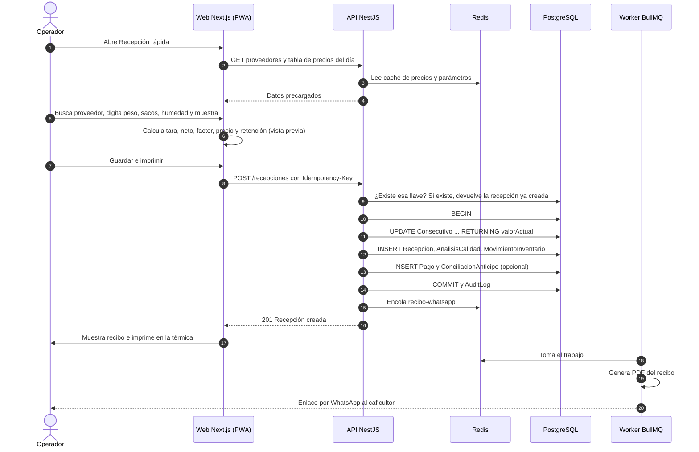

# Secuencia de la recepción rápida

Flujo de CU-01 (`docs/TECNICO.md`). Fuente: anexo de `docs/TECNICO.md`.

```mermaid
sequenceDiagram
  autonumber
  actor Op as Operador
  participant Web as Web Next.js (PWA)
  participant API as API NestJS
  participant R as Redis
  participant DB as PostgreSQL
  participant W as Worker BullMQ
  Op->>Web: Abre Recepción rápida
  Web->>API: GET proveedores y tabla de precios del día
  API->>R: Lee caché de precios y parámetros
  API-->>Web: Datos precargados
  Op->>Web: Busca proveedor, digita peso, sacos, humedad y muestra
  Web->>Web: Calcula tara, neto, factor, precio y retención (vista previa)
  Op->>Web: Guardar e imprimir
  Web->>API: POST /recepciones con Idempotency-Key
  API->>DB: ¿Existe esa llave? Si existe, devuelve la recepción ya creada
  API->>DB: BEGIN
  API->>DB: UPDATE Consecutivo ... RETURNING valorActual
  API->>DB: INSERT Recepcion, AnalisisCalidad, MovimientoInventario
  API->>DB: INSERT Pago y ConciliacionAnticipo (opcional)
  API->>DB: COMMIT y AuditLog
  API->>R: Encola recibo-whatsapp
  API-->>Web: 201 Recepción creada
  Web->>Op: Muestra recibo e imprime en la térmica
  W->>R: Toma el trabajo
  W->>W: Genera PDF del recibo
  W-->>Op: Enlace por WhatsApp al caficultor
```
